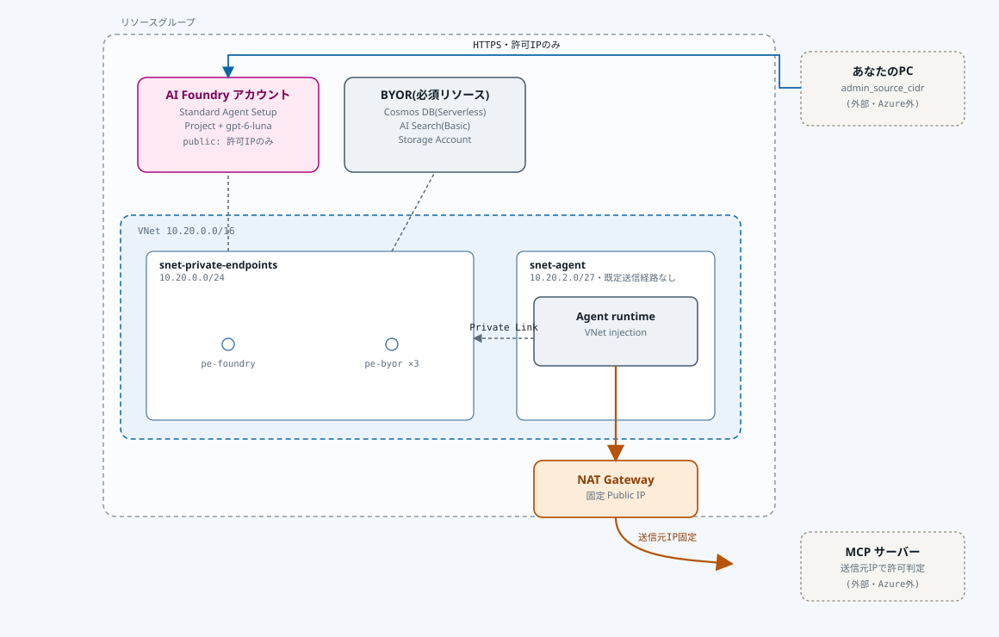

# closed_foundry

Azure AI Foundry の **Agent (MCPツール呼び出し) の送信元(egress) IPを固定**できるか検証するための
Terraform 一式です。既存リソースグループに、Standard Agent Setup (Bring Your Own VNet) +
NAT Gateway を構築します。

## 構成

- 公式 AVM パターンモジュール `Azure/avm-ptn-aiml-ai-foundry/azurerm` を使用
- AI Foundry アカウント (kind=AIServices) + Project + モデルデプロイ (既定: `gpt-6-luna`)
  - 受信: パブリックエンドポイント有効・`admin_source_cidr` からのみ許可(network ACLs)。
    Private Endpoint も併設(Agentランタイム自身のアクセス用)
  - 送信: Agentランタイムを `snet-agent`(VNet injection)に配置し、既定の送信経路を無効化。
    NAT Gateway 経由に強制することで、MCPサーバーへの送信元IPを固定
- Standard Agent Setup の必須BYORリソース: Cosmos DB(自前作成・Serverless) / AI Search(Basic) / Storage Account
- 動作確認用の踏み台VMは不要(パブリックアクセスをIP制限しているため、自分の端末から直接呼べる)

## アーキテクチャ



- **青**: 管理者PC → AI Foundry パブリックエンドポイント(`admin_source_cidr` のみ許可)
- **グレー破線**: Agent runtime ↔ Cosmos DB / AI Search / Storage(Private Link・VNet内部)
- **オレンジ**: Agent runtime → NAT Gateway → MCPサーバー(送信元IP固定。この検証の本題)

## 前提

- `az login` 済みであること
- 対象のリソースグループが存在すること(このコードでは作成しません。既存のものを利用します)
- 利用するモデル (既定 `gpt-6-luna`, version `2026-09-22`) が対象リージョンで提供されていること
  - `az cognitiveservices model list --location <region>` で確認できます

## ディレクトリ構成

```
.
├── README.md
└── terraform/       # Terraformコード一式(このディレクトリで実行する)
    ├── *.tf
    ├── local.auto.tfvars.example
    └── local.auto.tfvars   # 自分で作成する。gitignore対象
```

## 設定 (local.auto.tfvars)

サブスクリプション・リソースグループ・許可IPはコードにハードコードせず、`*.auto.tfvars` ファイルで
渡します。`*.auto.tfvars` は `terraform plan`/`apply` 実行時に**同じディレクトリ内のものが
自動で読み込まれる**ので、`source` や `export` は不要です(別ディレクトリに置くと自動読み込みされ
ないので、`terraform/` 配下に置いてください)。

```bash
cd terraform
cp local.auto.tfvars.example local.auto.tfvars
```

`local.auto.tfvars` を編集(`local.auto.tfvars` は `.gitignore` 済みでコミットされません):

```hcl
# subscription_id を指定しなければ az account show の現在のサブスクリプションが使われる
# subscription_id     = "00000000-0000-0000-0000-000000000000"
resource_group_name = "rg-hogehoge"
admin_source_cidr   = "203.0.113.5/32"   # 自分のグローバルIP。curl -s https://ifconfig.me で確認
```

`admin_source_cidr` は「AI Foundryのパブリックエンドポイントへの直接アクセスを許可する送信元」を
CIDR 表記(IPアドレス + プレフィックス長)で指定します。`/32` は「そのIP1つだけ許可」という意味です。
自宅回線・モバイル回線などでIPが変わると呼べなくなるので、その場合は現在のIPを確認し直して
`local.auto.tfvars` を更新 → `terraform apply` してください。

## デプロイ

```bash
cd terraform   # 上の設定済みなら既にこのディレクトリにいるはず
terraform init
terraform plan
terraform apply
```

## 動作確認 (送信元IP固定のテスト)

1. `terraform output nat_gateway_public_ip` で固定IPを確認し、検証用MCPサーバー側の許可リストに登録
2. `terraform output ai_foundry_endpoint` のエンドポイントに対し、`admin_source_cidr` の端末から
   Foundry Agent SDK / REST API でMCPツールを設定したAgentを作成・実行
3. MCPサーバー側のアクセスログを確認し、送信元IPが `nat_gateway_public_ip` と一致することを確認

`admin_source_cidr` 以外のIPから同じエンドポイントを叩くと拒否されることも合わせて確認してください。

## 後片付け

```bash
terraform destroy
```

## コスト目安

このリソース一式は時間課金のものが多いため、検証が終わったら `terraform destroy` してください。
概算(japaneast、放置した場合の月額目安):

| リソース | 月額目安 |
|---|---|
| AI Search (Basic) | 約¥11,000 |
| NAT Gateway + 固定Public IP | 約¥5,300 |
| Private Endpoint ×4 | 約¥4,400 |
| Private DNS Zone ×6 | 約¥450 |
| Cosmos DB (Serverless) | ほぼ¥0(従量課金) |
| Storage Account | ほぼ¥0 |

半日〜1日程度の検証で `destroy` するなら実費は数百〜¥1,000程度に収まります。

## 補足・既知の制限

- Standard Agent Setup は仕様上 Cosmos DB / AI Search / Storage Account が必須です(使うツールに
  関わらず)。詳細: https://learn.microsoft.com/azure/foundry/agents/concepts/standard-agent-setup
- Cosmos DB は AVM モジュール経由だと Serverless 化ができないため、`cosmosdb.tf` で自前作成し
  `existing_resource_id` として渡しています。
- モデルのデプロイに失敗する場合は `variables.tf` の `model_name` / `model_version` /
  `model_capacity` を利用可能なものに変更してください。
