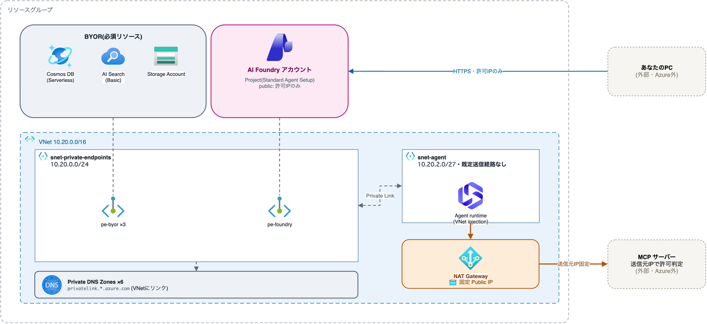

# アーキテクチャ

Foundry Agent(MCPツール呼び出し)の送信元IPを固定し、MCPサーバー側で許可リストとして
使えるようにするための構成。受信・内部通信・送信の3つの経路に分けて説明する。

編集用の draw.io ソース([architecture.drawio](architecture.drawio))も用意した。
Microsoft公式の Azure Architecture Icons(draw.io 同梱ライブラリ)を使っている。
[draw.io](https://app.diagrams.net/) や VS Code の Draw.io Integration 拡張で開いて編集し、
変更したら `architecture.png` としてエクスポートし直すこと。

## 通信経路

### ① 管理者 → AI Foundry(パブリック・IP許可)

AI Foundry のパブリックエンドポイントは有効にしたまま、`network_acls` で
`admin_source_cidr` 以外からの接続を拒否している。動作確認用の踏み台VMを用意しなくても、
手元の端末から直接 Agent API / Foundry Portal を呼べる。

### ② Agent runtime ↔ 自前で用意して使わせるリソース(Private Link・VNet内部)

Agent の会話履歴・スレッド・エージェント定義(Cosmos DB)、ベクトルストア(AI Search)、
アップロードファイル(Storage Account)は、Microsoft管理ではなく**自分のサブスクリプションに
自前で用意して使わせる**必要がある(BYOR = Bring Your Own リソース と呼ばれる)。
Standard Agent Setup の必須リソースで、これらはパブリックアクセスを一切許可しておらず、
Private Endpoint 経由でのみ到達できる。
`snet-agent` からは同一 VNet 内の `snet-private-endpoints` に直接ルーティングされる。

これらのPrivate Endpointに到達できるのは、VNetにリンクされた Private DNS Zone
(`privatelink.*.azure.com` 系、本リポジトリでは6ゾーン)が各サービスのFQDNを
プライベートIPに解決しているため。DNSゾーンがなければ名前解決自体ができず、
Private Endpointを作っても到達できない。

これらは MCP を呼ぶかどうかに関わらず、Standard Agent Setup(= VNet injection)を使う以上
必須のリソースになる。詳細: [Set up standard agent resources for Foundry Agent Service](https://learn.microsoft.com/azure/foundry/agents/concepts/standard-agent-setup)

### ③ Agent runtime → NAT Gateway → MCPサーバー(送信元IP固定)ーーこの検証の本題

`snet-agent` は既定の送信経路を持たない(`default_outbound_access_enabled = false`)。
これにより Agent がインターネット上の MCP サーバーへ送信する通信は、サブネットに
アタッチされた NAT Gateway の固定 Public IP を経由するルート以外に存在しなくなる。

MCP サーバー側は、この NAT Gateway の Public IP(`terraform output nat_gateway_public_ip`)
1つだけを許可リストに登録すればよい。

## サブネット構成

| サブネット | CIDR | 用途 |
|---|---|---|
| `snet-private-endpoints` | `10.20.0.0/24` | AI Foundry / Cosmos DB / AI Search / Storage の Private Endpoint |
| `snet-agent` | `10.20.2.0/27` | Agent runtime。`Microsoft.App/environments` 委任、既定送信経路なし |

## 図中の凡例

- **青**: 管理者PC → AI Foundry パブリックエンドポイント(`admin_source_cidr` のみ許可)
- **グレー破線**: Agent runtime ↔ Cosmos DB / AI Search / Storage(Private Link・VNet内部)
- **オレンジ**: Agent runtime → NAT Gateway → MCPサーバー(送信元IP固定)

## 参考

- [Set up standard agent resources for Foundry Agent Service](https://learn.microsoft.com/azure/foundry/agents/concepts/standard-agent-setup) —
  BYOリソース(Storage / AI Search / Cosmos DB)がなぜ必須なのかの一次情報
- [Foundry Agent Service のプライベート ネットワークを設定する](https://learn.microsoft.com/ja-jp/azure/foundry/agents/how-to/virtual-networks) —
  VNet injection・サブネット委任・DNSゾーン構成(本リポジトリの6ゾーンと対応)・
  Bastion/VPN/ExpressRouteでのアクセス方法・トラブルシューティングまで一次情報として詳しい
- [docs/tips/terraform.md](tips/terraform.md) — Terraform/AVMモジュールのハマりどころ
- [docs/tips/azure.md](tips/azure.md) — Azure運用のTips
- [docs/tips/mcp-oauth.md](tips/mcp-oauth.md) — AgentからMCPサーバーへのOAuth接続のハマりどころ
